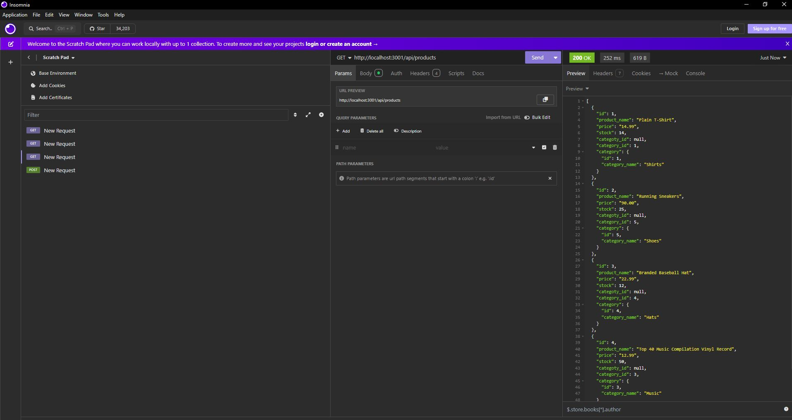
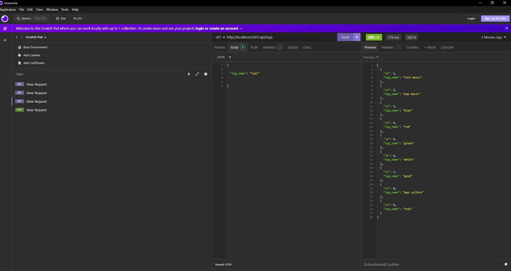
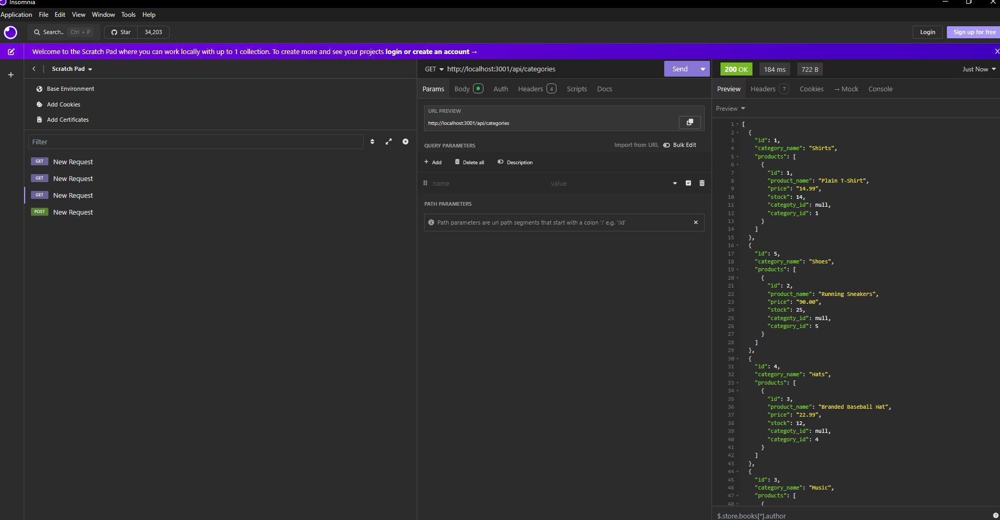

# travel-planner

## Description

Welcome to the E-Commerce Backend project! This repository contains the server-side code for a scalable e-commerce application. The backend is designed to handle various functionalities.Built with Express.js and Sequelize, this backend provides a robust framework for managing products, tags, and categories, with PostgreSQL as the database.

([Link to video walkthrough](https://drive.google.com/file/d/1chuTSfNs6uhfXkUkiy6_qdFcUuMCpBBo/view))

([Code source location](https://github.com/Ashleighjg/e-commerce-backend))

## Table of Contents

- [Installation](#installation)
- [Usage](#usage)
- [License](#license)
- [Contributing](#contributing)
- [Tests](#tests)
- [Questions](#questions)

## Installation

N/A

## Usage

Tech Stack
Node.js: JavaScript runtime for building server-side applications.
Express.js: Web framework for creating RESTful APIs.
Sequelize: Promise-based ORM for Node.js to interact with PostgreSQL.
PostgreSQL: Powerful, open-source relational database.

API Endpoints

Products

GET /api/products - Retrieve a list of products.
GET /api/products/:id - Retrieve a single product by ID.
POST /api/products - Create a new product.
PUT /api/products/:id - Update an existing product by ID.
DELETE /api/products/:id - Delete a product by ID.
Tags

GET /api/tags - Retrieve a list of tags.
GET /api/tags/:id - Retrieve a single tag by ID.
POST /api/tags - Create a new tag.
PUT /api/tags/:id - Update an existing tag by ID.
DELETE /api/tags/:id - Delete a tag by ID.
Categories

GET /api/categories - Retrieve a list of categories.
GET /api/categories/:id - Retrieve a single category by ID.
POST /api/categories - Create a new category.
PUT /api/categories/:id - Update an existing category by ID.
DELETE /api/categories/:id - Delete a category by ID.

## License

This project is licensed under the ([MIT](https://opensource.org/licenses/MIT)) license.

## Contributing

Portions of this code is sourced from Xpert Learning Assistant.

([Xpert Learning Assistant](https://bootcampspot.instructure.com/courses/6022/external_tools/313))

## Tests

N/A

## Questions

If you have any questions you can email me at Ashleighjg@gmail.com or contact me via Github username Ashleighjg.
